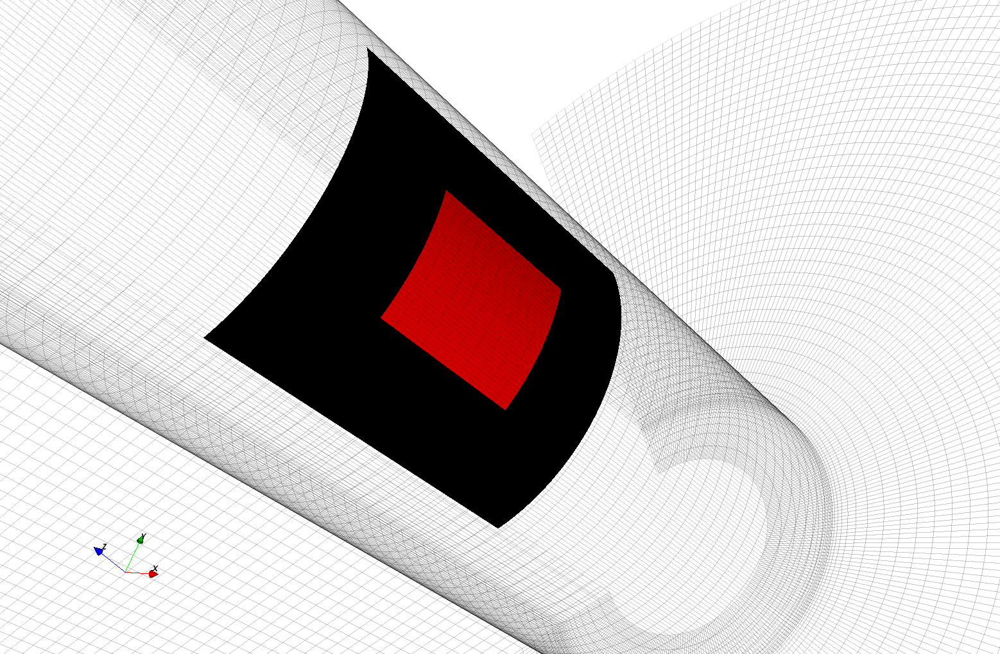

Bent Patch Antenna
==================

* Setup & Simulate a bent patch antenna using a cylindrical mesh

Introduction
-------------
**This tutorial covers:**

* Setup of a Bent Patch Antenna (see for comparison: :ref:`simple_patch_antenna`)
* setup of a *cylindrical FDTD mesh*.
* Calculate the S-Parameter and input impedance
* Calculate far-field pattern 2D/3D

Python Script
-------------
Get the latest version `from git <http://www.openems.de/gitweb/?p=openEMS.git;a=blob_plain;f=matlab/Tutorials/Bent_Patch_Antenna.m;hb=refs/heads/master>`_.

.. include:: ./__Bent_Patch_Antenna.txt

Images
-------------

    
    3D view of the Bent Patch Antenna (AppCSXCAD)

.. figure:: images/Bent_Patch_Pattern.png
    :width: 80%
    :alt: Farfield pattern
    
    Farfield pattern on an xy- and xz-plane
    
