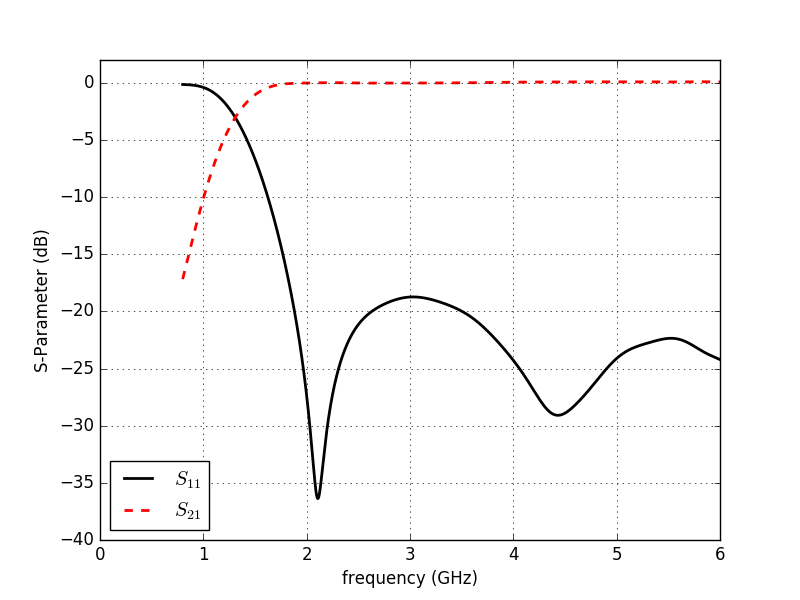
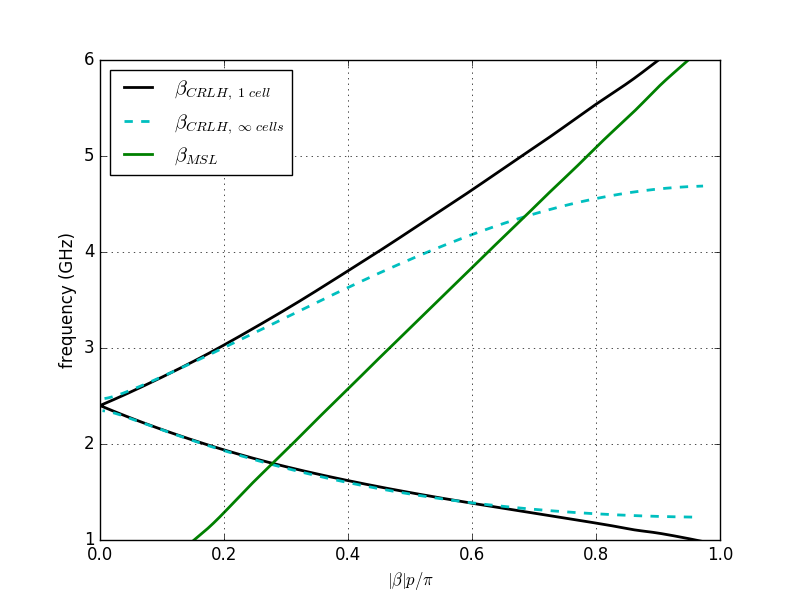

CRLH Parameter Extraction
=========================

* Setup a composite-right/left-handed (CRLH) unit cell and extract the equivalent circuit parameter.

Introduction
-------------
**This tutorial covers:**

* Setup a feeding mircostrip line & port
* Apply an inhomogeneous mesh used for improved accuracy and simulation speed
* Use an internal clss to setup a CRLH unit cell
* Use the port voltages and currents to extract the unit cell equivalent circuit parameter

.. figure:: images/CRLH_cell.png
    :width: 80%
    :alt: CRLH unit cell with feeding MSL.
    
    CRLH unit cell with feeding MSL.

Python Script
-------------
Get the latest version `from git <http://www.openems.de/gitweb/?p=openEMS.git;a=blob_plain;f=matlab/Tutorials/Bent_Patch_Antenna.m;hb=refs/heads/master>`_.

.. include:: ./__CRLH_Extraction.txt

Images
-------------

    
    CRLH cell S-parameter
    

    
    CRLH unit cell dispersion diagram
