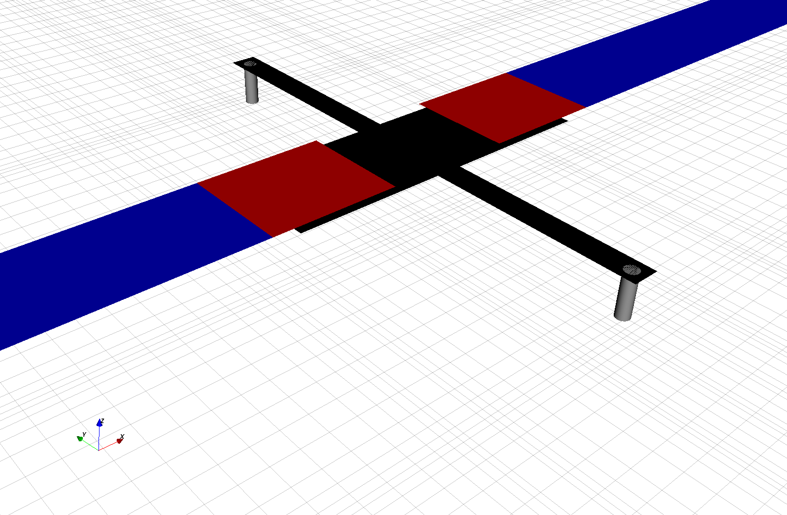
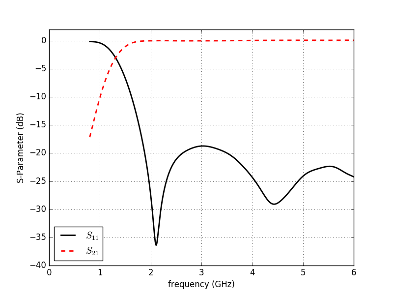
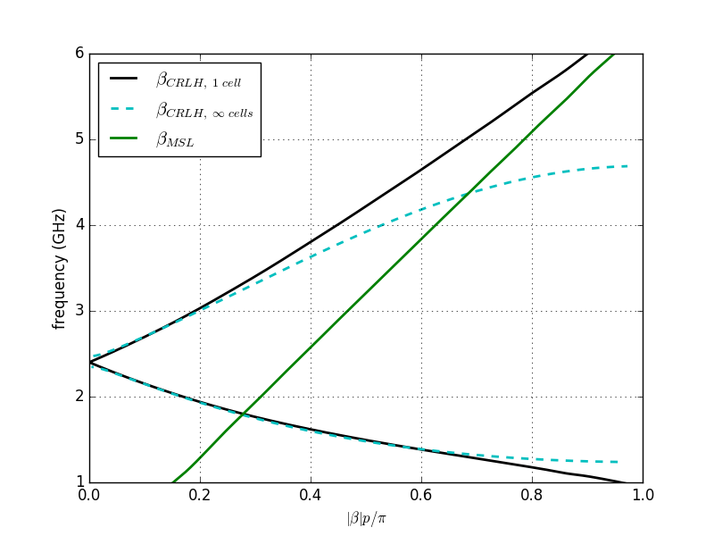

CRLH Parameter Extraction
=========================

* Setup a composite-right/left-handed (CRLH) unit cell and extract the equivalent circuit parameter.

Introduction
-------------
**This tutorial covers:**

* Setup a feeding mircostrip line & port
* Apply an inhomogeneous mesh used for improved accuracy and simulation speed
* Use an internal clss to setup a CRLH unit cell
* Use the port voltages and currents to extract the unit cell equivalent circuit parameter

    
    CRLH unit cell with feeding MSL.

Python Script
-------------
Get the latest version `from git <https://raw.githubusercontent.com/thliebig/openEMS/master/python/Tutorials/CRLH_Extraction.py>`_.

.. include:: ./__CRLH_Extraction.txt

Images
-------------

    
    CRLH cell S-parameter
    

    
    CRLH unit cell dispersion diagram
