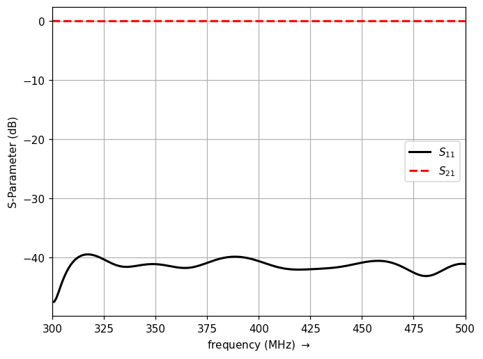
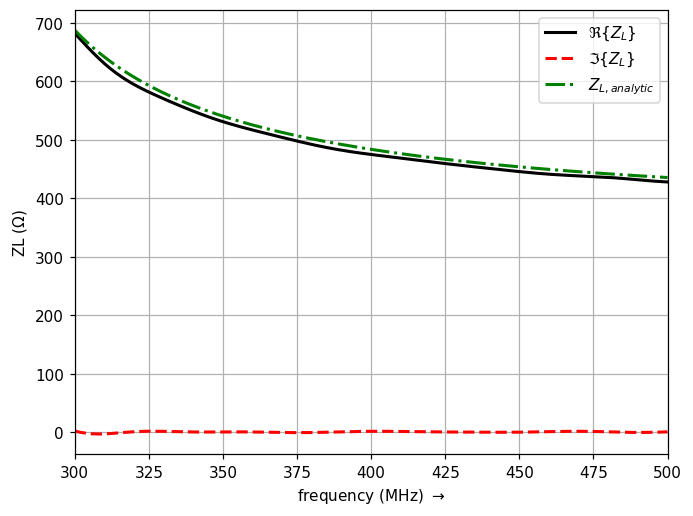

.. _tutorial_circ_waveguide:

Circular Waveguide
==================

* A circular metallic waveguide excited in its dominant TE11 mode on a cylindrical mesh, with the wave impedance compared against the analytic result.

Introduction
-------------
**This tutorial covers:**

* Setup of a cylindrical coordinate system (``CoordSystem=1``) for a circular cross-section
* Mode-matched circular waveguide ports (``AddCircWaveGuidePort``, TE11)
* Calculate the S-Parameter and the wave impedance
* Comparison of the simulated impedance with the analytic TE11 solution

Python Script
-------------
Get the latest version `from git <https://raw.githubusercontent.com/thliebig/openEMS/master/python/Tutorials/Circ_Waveguide.py>`_.

.. include:: ./__Circ_Waveguide.txt

Images
-------------

    S-Parameter of the circular waveguide — the TE11 mode propagates almost
    without reflection well above cut-off

    Simulated wave impedance against the analytic TE11 result

.. seealso::
    The :ref:`Rectangular Waveguide <tutorial_rect_waveguide>` tutorial, which
    uses the same port setup and post-processing on a Cartesian mesh, and the
    same tutorial for the
    :ref:`Octave/Matlab interface <octave_tutorial_circ_waveguide>`.
