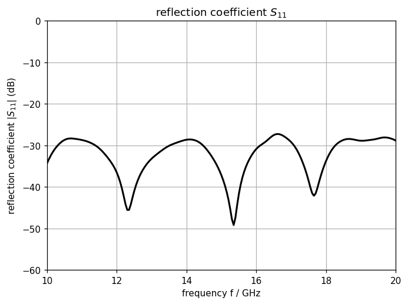
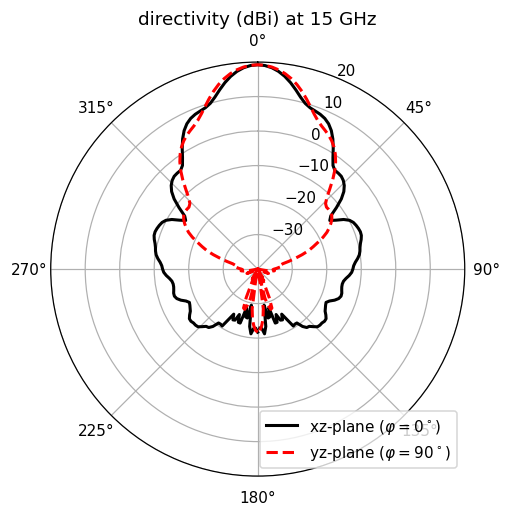
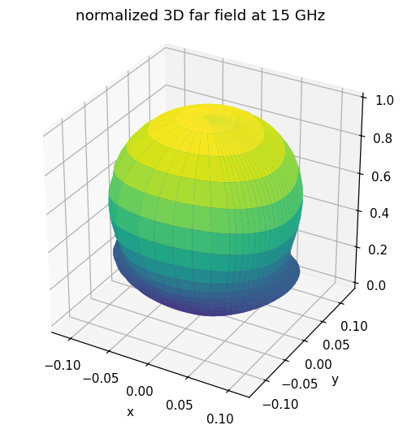

.. _tutorial_conical_horn:

Conical Horn Antenna
=====================

* A conical horn antenna fed by a circular waveguide in its dominant TE11 mode. Horn and feed are built as a single rotationally symmetric body from a cross-sectional polygon swept about the z-axis.

Introduction
-------------
**This tutorial covers:**

* Rotationally symmetric geometry with ``AddRotPoly`` on a **Cartesian** mesh — the circular profile is approximated by the rotational polygon
* Circular waveguide port (``AddCircWaveGuidePort``, TE11 mode) as the feed
* Leaving one face out of the NF2FF box with ``CreateNF2FFBox(directions=...)``, because the feed crosses it
* Calculate the S-Parameter and the input impedance
* Far-field pattern, directivity and aperture efficiency via NF2FF

Python Script
-------------
Get the latest version `from git <https://raw.githubusercontent.com/thliebig/openEMS/master/python/Tutorials/Conical_Horn_Antenna.py>`_.

.. include:: ./__Conical_Horn_Antenna.txt

Images
-------------

    Reflection coefficient of the circular waveguide feed

    Directivity in the xz- and yz-plane at 15 GHz

    Normalized 3D far-field pattern at 15 GHz

.. seealso::
    The :ref:`pyramidal Horn Antenna <tutorial_horn_antenna>` tutorial, and the
    same tutorial for the
    :ref:`Octave/Matlab interface <octave_tutorial_conical_horn>`.
