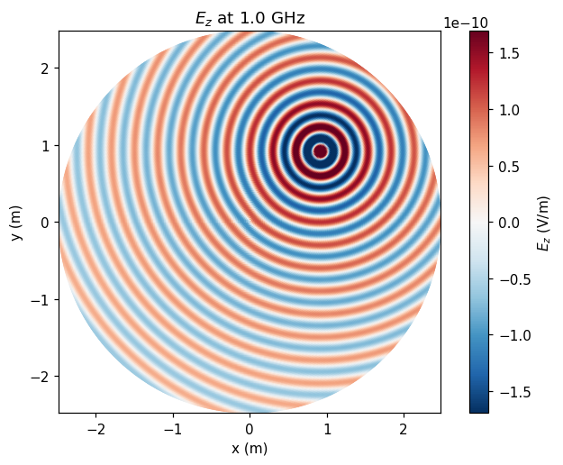
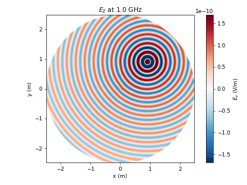

.. _tutorial_cylindrical_wave:

2D Cylindrical Wave
====================

* A cylindrical wave launched by an off-centre dipole, simulated on a cylindrical mesh with nested azimuthal sub-grids.

Introduction
-------------
**This tutorial covers:**

* Cylindrical coordinate system (``CoordSystem=1``) with nested sub-grids (``MultiGrid``), which halve the azimuthal line count towards the axis
* An off-centre dipole excitation, so the wave is not rotationally symmetric
* A time-domain VTK dump and a frequency-domain HDF5 dump side by side
* Reading the complex E_z phasor back with ``HDF5Dump`` and animating its phase

Python Script
-------------
Get the latest version `from git <https://raw.githubusercontent.com/thliebig/openEMS/master/python/Tutorials/CylindricalWave_CC.py>`_.

.. include:: ./__CylindricalWave_CC.txt

Notes
------

**Sub-grid azimuthal resolution:** the outermost sub-domain carries the finest
azimuthal mesh and each inner sub-grid halves that count, so the angular cell
size scales with the radius. A uniform mesh would over-sample extremely near
the axis and drive the timestep down.

**AppCSXCAD limitation:** the geometry viewer does not render the sub-grid
structure — it shows the finest azimuthal mesh at all radii. The actual
multi-resolution grid only becomes visible in the field dump.

Images
-------------

    Real part of the E_z phasor at 1 GHz — the wave spreads from the
    off-centre source and stays continuous across the sub-grid boundaries

    Phase animation of the same phasor, showing the outward propagation

.. seealso::
    The same tutorial for the
    :ref:`Octave/Matlab interface <octave_tutorial_cylindrical_wave>`.
