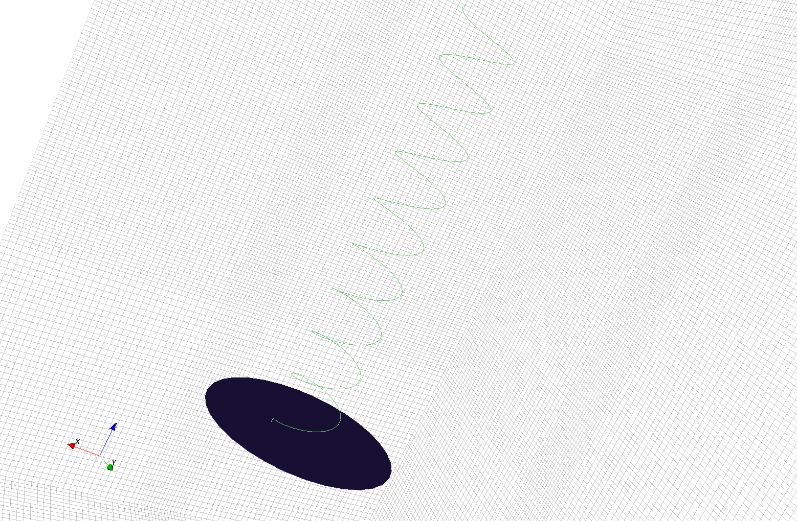
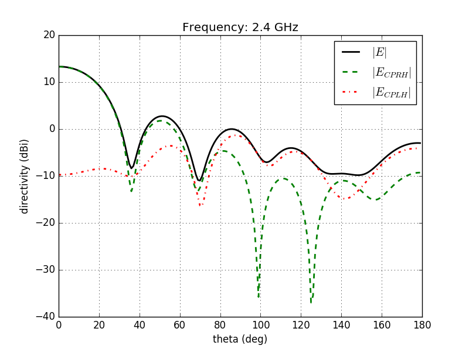

Helical Antenna
===============

Introduction
-------------
**This tutorial covers:**

* setup of a helix using the wire primitive
* setup a lumped feeding port (R_in = 120 Ohms)
* adding a near-field to far-field (nf2ff) box using an efficient subsampling
* calculate the S-Parameter of the antenna
* calculate and plot the far-field pattern

Python Script
-------------
Get the latest version `from git <http://www.openems.de/gitweb/?p=openEMS.git;a=blob_plain;f=matlab/Tutorials/Helical_Antenna.m;hb=refs/heads/master>`_.

.. include:: ./__Helical_Antenna.txt

Images
-------------

    
    3D view of the Helical Antenna (AppCSXCAD)

    
    Far-Field pattern showing a right-handed circular polarization.
