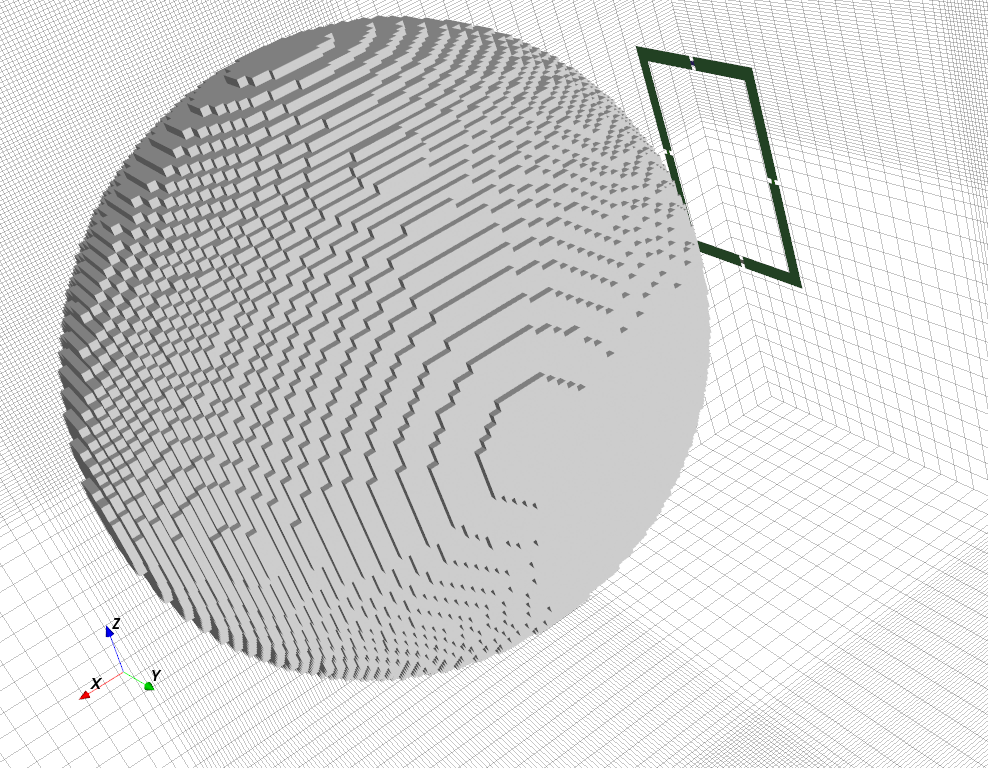
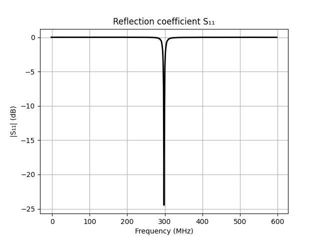
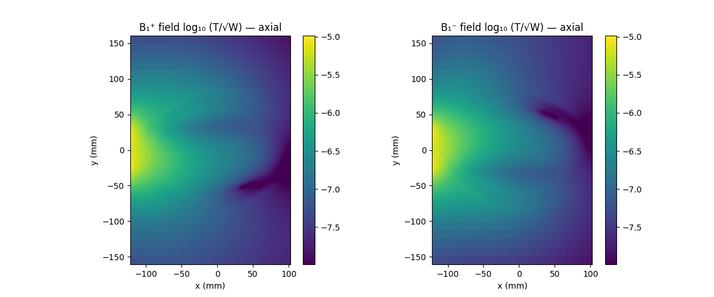
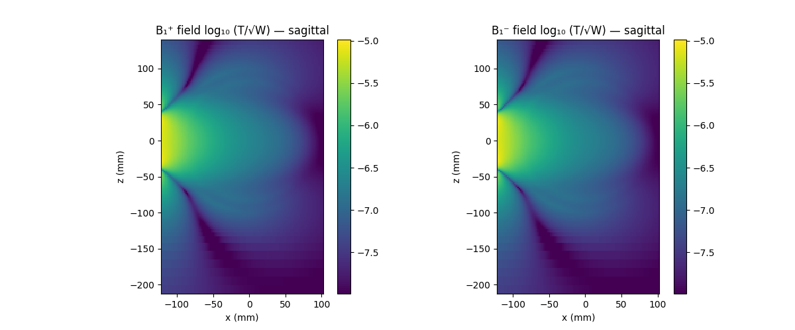
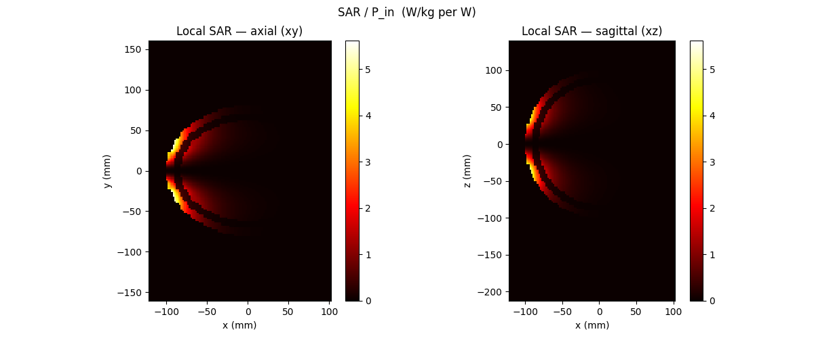

.. _tutorial_mri_loop_coil:

7T MRI Loop Coil
=================

* A surface loop coil for 7 T MRI (proton Larmor frequency 298 MHz), tuned to
  resonance with lumped capacitors and placed next to a human head model, used
  to map the B1 transmit/receive fields and the local SAR.

Introduction
-------------
**This tutorial covers:**

* Loop coil built from metal strips with lumped capacitors in the gaps, tuned to resonance at 298 MHz
* Lumped port feed and resonance check via S11 and the feed admittance
* Reading a voxel body model from an HDF5 ``DiscMaterial`` file, with automatic fallback to the bundled ellipsoidal head phantom
* Disabling cell-averaging (``CellConstantMaterial``) as required for SAR averaging per IEC/IEEE 62704-1
* Field dumps read back with ``HDF5Dump``, normalized to the accepted port power
* B1+ / B1- maps in the axial and sagittal plane, and the local SAR distribution

Python Script
-------------
Get the latest version `from git <https://raw.githubusercontent.com/thliebig/openEMS/master/python/Tutorials/MRI_Loop_Coil.py>`_.

.. include:: ./__MRI_Loop_Coil.txt

Images
-------------

    Loop coil with its lumped capacitors next to the voxel head model (AppCSXCAD)

    Reflection coefficient of the feed port — the coil is tuned to the 298 MHz Larmor frequency

    B1+ and B1- field in the axial (xy) plane, normalized to the accepted port power

    B1+ and B1- field in the sagittal (xz) plane, normalized to the accepted port power

    Local SAR per watt of accepted power, in the axial (xy) and sagittal (xz) plane

Body Model
----------

The tutorial uses the **Ella** voxel model from the IT'IS Virtual Family
dataset, expected as a pre-converted ``Ella_centered_298MHz.h5`` in the working
directory. The dataset is free for academic and non-commercial use but requires
registration with the IT'IS Foundation
(https://itis.swiss/virtual-population/); the conversion to openEMS'
``DiscMaterial`` HDF5 format is done once by ``Convert_VF_DiscMaterial`` in the
Octave interface.

If that file is absent, the script warns and falls back to the bundled
``phantoms/phantom_head_298MHz.h5`` — a three-layer ellipsoidal head phantom
(skin / skull / brain) with tissue properties at 298 MHz from the IT'IS
database. It uses the same HDF5 format, so the full B1 and SAR workflow runs
unchanged; the images above were produced with this fallback.

Literature
----------

* A. Christ et al., "The Virtual Family — Development of surface-based
  anatomical models of two adults and two children for dosimetric simulations,"
  *Phys. Med. Biol.*, vol. 55, 2010.

.. seealso::
    The same tutorial for the :ref:`Octave/Matlab interface <octave_tutorial_mri_loop_coil>`.
