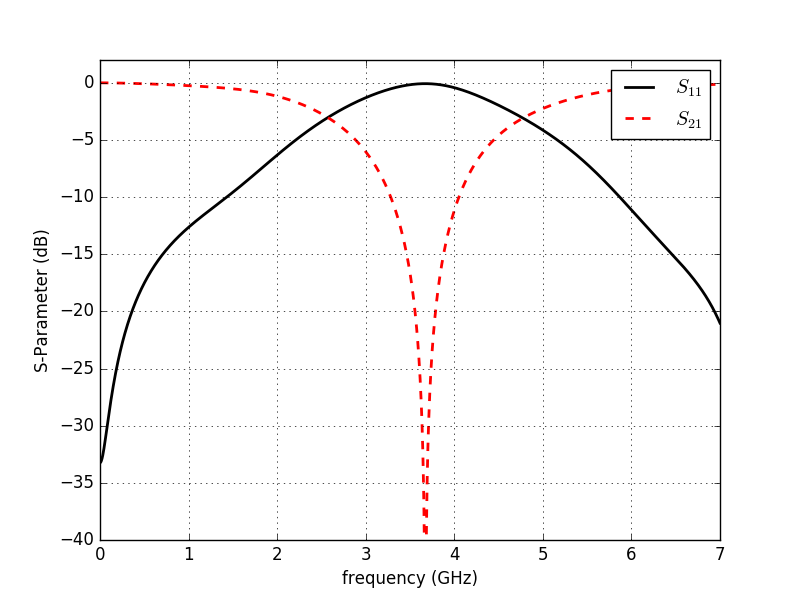

.. _tutorial_msl_notchfilter:

Microstrip Notch Filter
=======================

    * A straight MSL line with a open-ended stub to create a simple microwave filter.

Introduction
-------------
**This tutorial covers:**

* Setup a mircostrip line (MSL) and MSL port
* Apply an inhomogeneous mesh used for improved accuracy and simulation speed
* Calculate the S-Parameter of the filter

Python Script
-------------
Get the latest version `from git <https://raw.githubusercontent.com/thliebig/openEMS/master/python/Tutorials/MSL_NotchFilter.py>`_.

.. include:: ./__MSL_NotchFilter.txt

Images
-------------

    
    S-Parameter over Frequency
