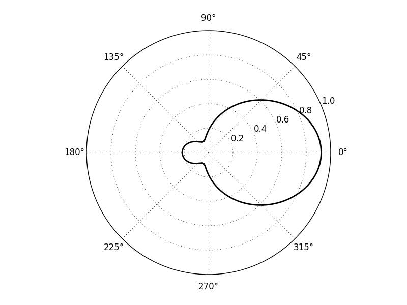
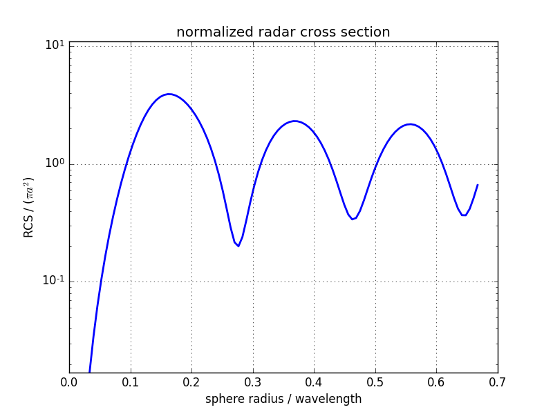

Metal Sphere Radar Cross Section
================================

    * A 3D simulation demonstrating a the total-field/scattered-field approach on a metallic sphere with a RCS (radar cross section) calculation.

Introduction
-------------
**This tutorial covers:**

* The total-field/scattered-field approach
* Calculation of a radar cross section (RCS)

Python Script
-------------
Get the latest version `from git <https://raw.githubusercontent.com/thliebig/openEMS/master/python/Tutorials/RCS_Sphere.py>`_.

.. include:: ./__RCS_Sphere.txt

Images
-------------

    
    Radar cross section pattern

    
    Normalized radar cross Section over normalized wavelength
