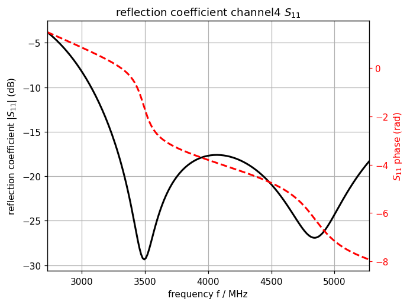
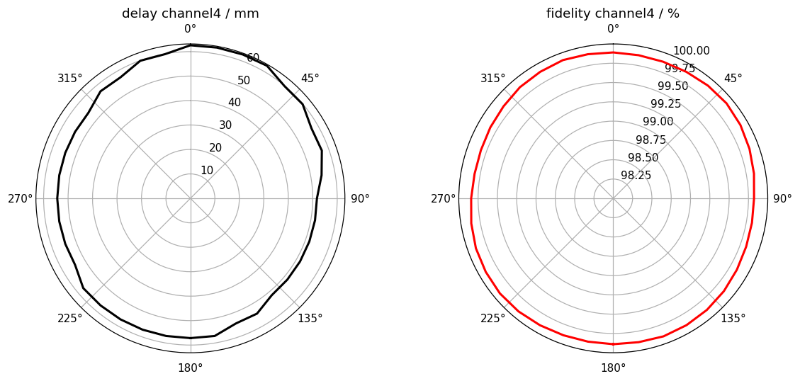

.. _tutorial_uwb_radar:

UWB Radar — Delay and Fidelity
===============================

* A simple UWB monopole characterised in the time domain: the delay from the source to the phase centre, and the fidelity — how similar the radiated waveform stays to the excitation.

Introduction
-------------
**This tutorial covers:**

* Gaussian excitation matched to the IEEE 802.15.4 UWB channel bandwidths (channels 1-5 and 7), selectable at the top of the script
* Graded meshing: fine resolution around the antenna, coarse in free space
* :func:`openEMS.utilities.DelayFidelity` for time-domain pulse characterisation, with complex weights on E_theta and E_phi so any polarisation can be examined
* Polar plots of delay (in mm) and fidelity (in %) against angle
* Gain and radiation efficiency from the NF2FF box

Python Script
-------------
Get the latest version `from git <https://raw.githubusercontent.com/thliebig/openEMS/master/python/Tutorials/RadarUWBTutorial.py>`_.

.. include:: ./__RadarUWBTutorial.txt

Images
-------------

    Reflection coefficient and phase for UWB channel 4

    Delay to the phase centre and fidelity of the radiated pulse against
    angle, for UWB channel 4

Notes
------

The delay resolution is set by the excitation bandwidth and the
``OverSampling`` parameter, and is printed by ``DelayFidelity``. The delay is
reported as a length (delay times c0) so it can be compared directly with the
antenna dimensions.

.. seealso::
    The same tutorial for the
    :ref:`Octave/Matlab interface <octave_tutorial_uwb_radar>`.
