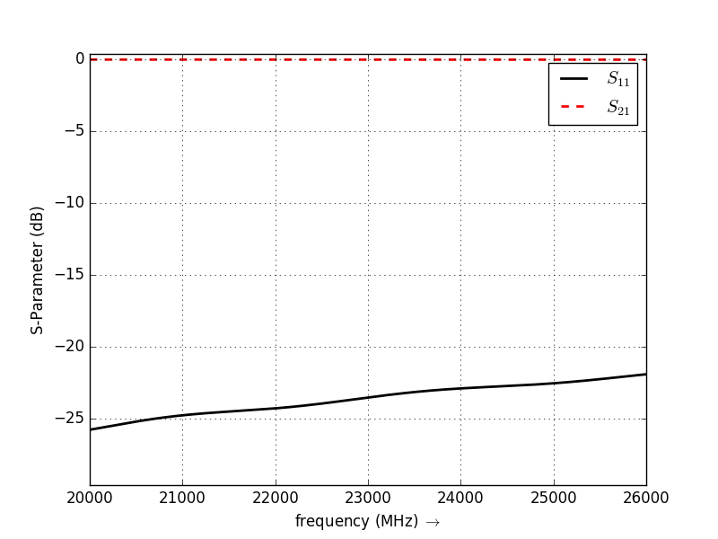

Rectangular Waveguide
=====================

    * A simple rectangular waveguide, showing the openEMS mode profile capabilities.

Introduction
-------------
**This tutorial covers:**

* Setup a mode profile excitation
* Create voltage and current probes using the mode profile
* Calculate the waveguide impedance and S-Parameter

Python Script
-------------
Get the latest version `from git <http://openems.de/gitweb/?p=openEMS.git;a=blob_plain;f=matlab/Tutorials/Rect_Waveguide.m;hb=HEAD>`_.

.. include:: ./__Rect_Waveguide.txt

Images
-------------

    
    S-Parameter over Frequency
