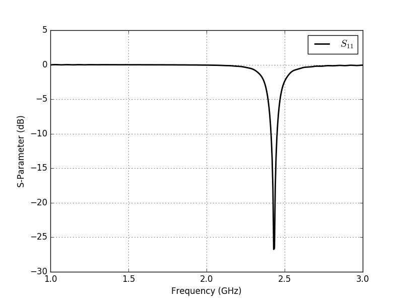
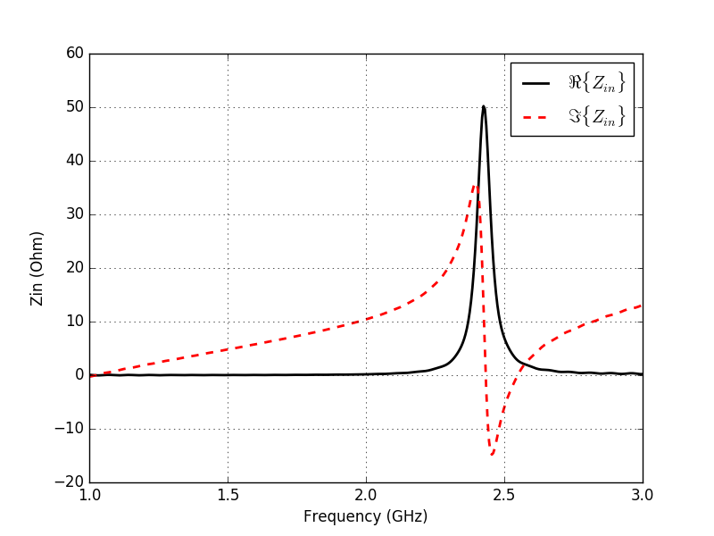
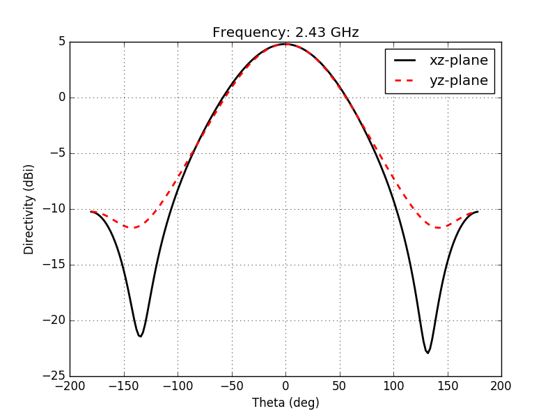

.. _simple_patch_antenna:

Simple Patch Antenna
====================

Introduction
------------
A simple patch antenna for 2.4 GHz.

**This tutorial covers:**

* Setup a patch, substrate and ground.
* Setup of a lumped feeding port.
* Adding a near-field to far-field (nf2ff) recording box.
* Calculate the S-Parameter of the antenna.
* Calculate and plot the far-field pattern

Python Script
-------------
Get the latest version `from git <http://www.openems.de/gitweb/?p=openEMS.git;a=blob_plain;f=matlab/Tutorials/Simple_Patch_Antenna.m;hb=refs/heads/master>`_.

.. include:: ./__Simple_Patch_Antenna.txt

Images
------

    
    S-Parameter over Frequency

    
    Antenna Input Impedance

    
    Farfield pattern for the  xy- and yz-plane.
