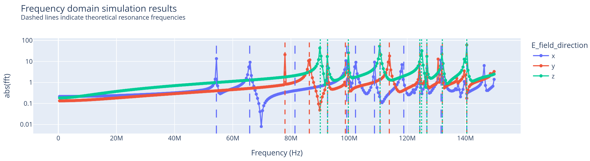

# Rectangular resonant cavity

This example simulates a [rectangular resonant cavity](https://en.wikipedia.org/wiki/Microwave_cavity#Rectangular_cavity) and extracts the resonance frequencies by exciting it with a Dirac delta.

# How to run the example

To run the simulation install the required packages (e.g. `pip install plotly`) and then simply run `python main.py`.
